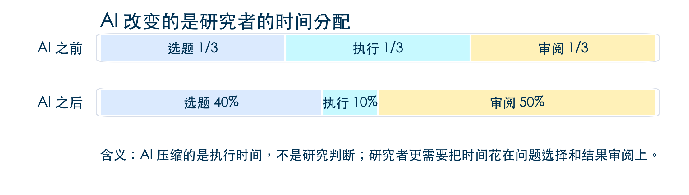

## 今天上午的目标

::: {.concept-box}
**讲座目标**

今天上午不要求大家已经会编程、会 Git，甚至不要求所有软件都已经准备好。

最低目标是：把电脑变成一个可以继续学习的研究工作台，知道每个工具装来解决什么问题，遇到卡点时知道如何自检。
:::


::: {.notes}
先稳住本科生：没装软件不是失败，今天本来就是环境课。硕博同学也许有些工具装过，但往往散落各处——今天的价值是把它们整合到一个工作台上。
:::

---

## 为什么经济学研究会被工具拖慢？

**传统的碎片化研究**

- 数据在 `Excel` 或 `Stata`; 清洗、画图和建模可能在 `Python`、`R`、`Matlab`; 正文在 `Word`、`Overleaf` 或 `LaTeX`; 
- AI 助手在浏览器聊天窗口; 
- 版本控制停留在文件名：`final`、`final2`、`最终版真的最终版`

. . .

::: {.example-box}
**AI 改变的是研究者的时间分配**

{fig-alt="AI 前后经济学研究任务时间分配对比：AI 之前选题、执行、审阅各占三分之一；AI 之后选题占 40%，执行占 10%，审阅占 50%。" width="100%"}

:::

. . .

**一站式科研的核心**：不是多装一个 AI 插件，而是把研究动作组织成 AI 赋能的**可重复、可检查、可交接**的流水线。

---

## AI 让执行变快，也让审阅变重要

::: {.concept-box}
**新的能力结构**

AI 最擅长压缩执行时间：读数据、写脚本、改格式、整理文献、生成初稿。

但执行变快以后，真正稀缺的是研究者的判断：问题是否重要？识别是否可信？结果是否可复现？结论是否越界？
:::

. . .

**今天上午先解决一个基础问题**

如果工具散落在多个窗口里，研究者很难审阅 AI 到底做了什么，也不方便进行上下文管理。因此，我们先把工具放到同一个工作台上。

# 一、开源 IDE 作为经济学研究工作台 {background-color="#003153"}

## 开源 IDE

::: {.concept-box}
**Integrated Development Environment（IDE）是什么？**

**IDE（集成开发环境）**将代码编辑、调试、版本控制、终端等工具整合在同一个界面中。**开源 IDE**（如 VS Code、JupyterLab、RStudio）具有高度可定制性和丰富插件生态，适合不同学科的研究需求。
:::

. . .

**开源 IDE 的角色**

- 开源 IDE 不是替代 `Python`、`Stata`、`R`、`Matlab`、`Jupyter` 或 `LaTeX`
  
- 它把这些工具放进同一个研究项目，让文件、终端、版本控制、笔记、AI 对话和论文写作在一处发生

---

## 为什么经济学研究者需要一个“编程基座”？

**在 AI 时代，“编程”这个概念被重新定义了**

- 用 Stata 写 do-file 是编程
  
- 用 LaTeX 写论文是编程
  
- 用 Markdown 写研究备忘录也是编程
  
- 用自然语言指挥 agent 修改一个项目，也是一种编程

. . .

| 区域 | 经济学研究中的用途 |
|:---|:---|
| Explorer | 项目结构、数据版本、输出位置 |
| Editor | Python、Stata do-file、Matlab、LaTeX、Markdown |
| Terminal | 可重复运行的命令与日志 |
| Chat | Copilot、Claude Code 等 AI 助手 |
| Source Control | 记录每一次研究改动 |

::: {.notes}
可以沿用“手机操作系统”的比喻：以前每个工具都有自己的桌面，现在它们共享一个工作台。
:::

---

## 上手操作演示 1：认识 IDE 工作环境 {style="text-align: center;"}

**以 VS Code 为例**

1. 确认界面四个核心区域：

   - **Explorer**（文件浏览）：左侧第一个图标
   - **Editor**（编辑区）：中间大区域
   - **Terminal**（终端）：底部面板，`` Ctrl+` `` 打开
   - **Source Control**（版本控制）：左侧第三个图标
   - **Copilot** (AI 助手)：左侧第四个图标

2. 打开一个已有项目文件夹：`File → Open Folder`

3. 观察文件树结构和终端提示符

::: {.notes}
第一个检查点：现在大家电脑上至少能打开 VS Code 吗？不能打开的先举手，我们记录问题，不在这里集体卡住。
:::

---

## 自检 1：VS Code 能打开吗？

::: {style="font-size: 1.1em;"}
```bash
# 终端中输入（不是 VS Code 里面，是系统的终端）
code --version
```
:::

. . .

| 系统 | 如果 `code` 命令找不到 |
|:---|:---|
| **macOS** | VS Code 内按 `Cmd+Shift+P` → 输入 “Shell Command: Install ‘code’ command in PATH” |
| **Windows** | 重装 VS Code，安装时勾选 “Add to PATH” |
| **Linux** | 通常 Snap 或包管理器安装后自动可用 |

. . .

::: {.callout-tip}
如果你还没装 VS Code：<https://code.visualstudio.com/> — 下载安装大约 3 分钟。
:::

# 二、基础软件安装与自检 {background-color="#003153"}

## 安装顺序：先能打开，再能运行

| 顺序 | 工具 | 今天的作用 | 自检方式 |
|:---|:---|:---|:---|
| 1 | VS Code | 统一工作台 | `code --version` |
| 2 | Git | 版本控制 | `git --version` |
| 3 | Python 3.10+ | 数据、图表、脚本 | `python --version` |
| 4 | Jupyter | Notebook 实操 | `jupyter --version` |
| 5 | GitHub 账号 | 远程备份与协作 | 能登录 github.com |

. . .

::: {.callout-tip}
如果某一步暂时失败，先记录，不要脱离主线。今天的目标不是把每台电脑都配置成一样，而是让每个人知道下一步该查哪里。
:::

---

## 工具 1：Git —— 版本控制

::: {.concept-box}
**Git 先作为本地工具理解**

Git 不是 GitHub。Git 是你电脑上的版本控制系统，负责记录每一次改动；GitHub 是远程平台，负责同步、备份和协作。
:::

. . .

**安装 Git**

| 系统 | 方法 |
|:---|:---|
| **macOS** | 终端输入 `git --version`，未安装会弹出 Xcode Command Line Tools 安装提示，点击安装 |
| **Windows** | 下载 <https://git-scm.com/download/win>，安装时选 “Use Git from the command line” |
| **Linux** | `sudo apt install git` 或 `sudo yum install git` |

. . .

**自检 + 首次配置**

```bash
git --version
git config --global user.name "Your Name"
git config --global user.email "your_email@example.com"
```

---

## Git 安装常见卡点

| 问题 | 可能原因 | 解决 |
|:---|:---|:---|
| `git` 命令找不到 | Git 未安装或 PATH 未配置 | 检查安装后是否重启了终端 |
| macOS 弹出 “无法验证开发者” | Gatekeeper 安全策略 | 系统偏好设置 → 安全性与隐私 → 仍要打开 |
| Windows 中文乱码 | 终端编码问题 | Git Bash 或 VS Code Terminal 通常无此问题 |

. . .

::: {.callout-tip}
**Git 今天我们只做本地操作**（记录改动、回退版本）。下午专门讲 GitHub 远程同步。
:::

---

## 工具 2：Python 3.10+ 与虚拟环境

**为什么要用虚拟环境？**

同一台电脑可能服务多个研究项目。虚拟环境让每个项目有自己的 Python 包，避免今天装的包影响明天的论文复现。

. . .

**安装 Python**

| 系统 | 推荐方法 |
|:---|:---|
| **macOS** | Homebrew：`brew install python@3.12`，或下载 Miniconda：<https://docs.anaconda.com/miniconda/> |
| **Windows** | 下载 Miniconda 或 <https://python.org/downloads/>（安装时勾选 “Add Python to PATH”） |
| **Linux** | `sudo apt install python3 python3-venv` |

. . .

**自检**

```bash
python --version        # 应输出 Python 3.10.x 或更高
python -m venv --help   # 确认 venv 可用
```

---

## Python 虚拟环境实操

**创建并激活虚拟环境**

```bash
# 在项目目录下
cd demo-project
python -m venv .venv

# 激活（macOS / Linux）
source .venv/bin/activate

# 激活（Windows PowerShell）
.venv\Scripts\activate
```

. . .

**安装常用包**

```bash
python -m pip install --upgrade pip
pip install pandas numpy matplotlib jupyter
```

. . .

**如何确认虚拟环境已激活？**

终端提示符前会出现 `(.venv)`。输入 `which python`（macOS/Linux）或 `where python`（Windows），路径应指向 `.venv` 内。

---

## Python 安装常见卡点

| 问题 | 可能原因 | 解决 |
|:---|:---|:---|
| `python` 指向 Python 2 | macOS 自带的旧版本 | 用 `python3` 代替，或安装 Miniconda |
| `pip install` 权限错误 | 系统 Python 受保护 | 先用 `python -m venv .venv` 创建虚拟环境 |
| Windows 找不到 python | 未勾选 “Add to PATH” | 重装并勾选，或用 Miniconda |
| `pip` 不是最新版 | — | `python -m pip install --upgrade pip` |

---

## 工具 3：Jupyter Notebook

**Jupyter 在研究中的角色**

| 形式 | 适合做什么 | 不适合做什么 |
|:---|:---|:---|
| `.ipynb`（Notebook） | 探索、备忘、图表、课堂演示 | 复杂项目的唯一入口 |
| `.py` / `.do` / `.m`（脚本） | 可重复脚本、批量运行、交接 | 长篇解释与随手记录 |
| `.qmd` / `.md`（文档） | 讲义、报告、研究说明 | 大规模计算 |

. . .

**安装与自检**

```bash
pip install jupyter ipykernel
jupyter --version
```

. . .

::: {.callout-tip}
Notebook 负责“想清楚和跑出来”；脚本负责“可重复和可交接”。两者不是替代关系。
:::

---

## 工具 4：GitHub 账号 + SSH Key

**GitHub 账号用于远程备份和协作**

如果只是自己电脑上的 `.git`，已经可以回退；如果要换电脑、课堂演示或合作者接手，就需要推送到 GitHub。

. . .

**注册账号**：<https://github.com/signup>（用户名建议用真名拼音或常用英文名）

. . .

**配置 SSH Key**

```bash
# 检查是否已有
ls ~/.ssh/id_ed25519.pub

# 如果没有，生成一个（一路回车）
ssh-keygen -t ed25519 -C "your_email@example.com"

# 复制公钥
cat ~/.ssh/id_ed25519.pub
```

. . .

然后：GitHub → Settings → SSH and GPG keys → New SSH Key → 粘贴公钥。

**自检**：`ssh -T git@github.com`，看到 “Hi xxx!” 即成功。

---

## SSH Key 常见卡点

| 问题 | 可能原因 | 解决 |
|:---|:---|:---|
| `Permission denied` | 公钥未添加到 GitHub | 重新检查 Settings → SSH Keys |
| `Could not resolve hostname` | 网络问题 | 检查是否能访问 github.com |
| 已有多个 SSH Key | 之前为其他服务生成过 | 用 `ssh -T git@github.com` 测试，GitHub 会自动匹配 |

. . .

::: {.callout-tip}
如果 SSH 配置暂时不成功，下午 Git 实操部分可以先做本地操作（`init`、`add`、`commit`），远程推送可以课后慢慢配。
:::

---

## 中场自检：你的基础链路跑通了吗？

| 检查项 | 命令 | ✅ |
|:---|:---|:---|
| VS Code 能打开 | `code --version` | ☐ |
| Git 已安装 | `git --version` | ☐ |
| Git 已配置用户名和邮箱 | `git config user.name` | ☐ |
| Python 3.10+ | `python --version` | ☐ |
| 虚拟环境能用 | `python -m venv --help` | ☐ |
| Jupyter 已安装 | `jupyter --version` | ☐ |
| GitHub 能登录 | 浏览器打开 github.com | ☐ |
| SSH Key 已配置 | `ssh -T git@github.com` | ☐ |

. . .

::: {.callout-tip}
**如果有问题，请记下来，课间或下午可以找我或同学一起排查。不要因为一个工具卡住就停下来。**
:::

# 三、VS Code 扩展：让工作台适配你的研究 {background-color="#003153"}

## VS Code 扩展是什么？

::: {.concept-box}
**扩展 = VS Code 的“应用”**

就像手机装 App 来扩展功能，VS Code 装扩展来支持不同语言（Python、Stata、LaTeX）、不同工具（Git、Jupyter、Docker）和 AI 助手。
:::

. . .

**今天必装的扩展**

| 扩展名 | Extension ID | 优先级 | 用途 |
|:---|:---|:---|:---|
| Python | `ms-python.python` | ⭐ 必装 | Python 语法检查、调试、环境识别 |
| Jupyter | `ms-toolsai.jupyter` | ⭐ 必装 | 打开和运行 `.ipynb` Notebook |
| GitLens | `eamodio.gitlens` | ⭐ 必装 | Git 历史可视化和行级 blame |
| Markdown All in One | `yzhang.markdown-all-in-one` | ⭐ 必装 | Markdown 编辑增强（Day 2 用） |
| LaTeX Workshop | `James-Yu.latex-workshop` | ⭐ 必装 | LaTeX 编译与 PDF 预览（Day 2 用） |
| Quarto | `quarto.quarto` | 🔧 建议 | Quarto 文档渲染 |
| GitHub Pull Requests | `GitHub.vscode-pull-request-github` | 🔧 建议 | 在 VS Code 内管理 PR |
| GitHub Copilot | `GitHub.copilot` | ⭐ 必装 | 行内 AI 代码补全（已内置 Kimi 2.7 Code） |
| GitHub Copilot Chat | `GitHub.copilot-chat` | ⭐ 必装 | 侧边栏 AI 对话 |
---

## 扩展安装演示

**方法一：VS Code 界面安装**

1. 点击左侧 Extensions 图标（或 `Ctrl+Shift+X`）
2. 搜索扩展名（如 “Python”）
3. 点击 Install

. . .

**方法二：一键脚本安装（推荐）**

```bash
# macOS / Linux
bash scripts/install-extensions.sh

# Windows PowerShell
.\scripts\install-extensions.ps1
```

. . .

**方法三：逐条命令行安装**

```bash
code --install-extension ms-python.python
code --install-extension ms-toolsai.jupyter
code --install-extension eamodio.gitlens
code --install-extension yzhang.markdown-all-in-one
code --install-extension James-Yu.latex-workshop
code --install-extension quarto.quarto
code --install-extension GitHub.vscode-pull-request-github
code --install-extension GitHub.copilot
code --install-extension GitHub.copilot-chat
code --install-extension vizards.deepseek-v4-for-copilot
code --install-extension johnny-zhao.oai-compatible-copilot
```

---

## 认识 demo-project

::: {style="font-size: 1em;"}
```text
demo-project/
├── data/raw/firm_panel.csv     # 原始数据（只读，可追溯）
├── scripts/generate_data.py    # 可复现数据生成脚本
├── notebooks/explore.ipynb     # 数据探索 Notebook
├── output/                     # 图、表输出位置
├── paper/main_zh.tex           # 中文 LaTeX 论文（Day 2 用）
├── prompts/prompt-cards.md     # 可复用提问模板
├── audit-log.md                # AI 使用记录
├── .vscode/                    # 推荐扩展 + LaTeX 编译配置
└── .gitignore                  # 区分"源文件"与"可再生成产物"
```
:::

. . .

**项目原则**

- 原始数据只读
- 脚本能从头重跑
- 输出有固定位置
- AI 参与要留下记录

---

## 上手操作演示 2：打开 demo-project {style="text-align: center;"}

1. VS Code → `File → Open Folder` → 选择 `demo-project/`

2. 观察 Explorer 中的文件树结构

3. 打开终端（`` Ctrl+` ``），确认当前目录在 `demo-project/`

4. 创建虚拟环境并安装依赖：

```bash
python -m venv .venv
source .venv/bin/activate      # Windows: .venv\Scripts\activate
pip install -r requirements.txt
```

5. 运行数据生成脚本：

```bash
python scripts/generate_data.py
```

. . .

**为什么跑这个脚本？** 验证 Python 环境可用，并让你看到“同一种子→同一数据”的可复现性。

---

## AI 助手登录与配置

::: {.concept-box}
**Copilot 的基础角色**

Copilot 适合低风险、机械性、容易验证的任务：补全读数据代码、生成描述统计、解释某个函数参数。
:::

. . .

**自检方式**

1. VS Code 左下角确认 GitHub 账号已登录
2. 打开 Copilot Chat（`Ctrl+Shift+I` 或 `Cmd+Shift+I`），输入 “hello”
3. 在 `.py` 文件中输入注释，观察是否出现行内补全（灰色文字）

---

## Copilot 现已内置国产模型

::: {.example-box}
**Kimi 2.7 Code 已直接集成到 GitHub Copilot**

最新版 Copilot 不再只能调用 OpenAI 模型——Kimi 2.7 Code 已*内置在 Copilot 中*。你在 Copilot Chat 中可以直接选择 Kimi 作为对话模型，无需额外配置 API Key。

这意味着即使 OpenAI 服务不稳定，你仍然可以使用 Copilot 的全部功能——由月之暗面的 Kimi 模型驱动。
:::

. . .

**如何切换模型**

在 Copilot Chat 面板中，点击模型选择器（输入框上方或右上角下拉菜单），从列表中选择 `Kimi 2.7 Code` 即可。无需任何额外配置。

---

## 接入更多国产模型：两个关键插件

**让 Copilot Chat 变成一个“模型聚合器”——在一个界面里调用多种大模型。**

. . .

**插件 1：DeepSeek V4 for Copilot Chat**

| 项目 | 内容 |
|:---|:---|
| Extension ID | `vizards.deepseek-v4-for-copilot` |
| 作用 | 在 Copilot Chat 中直接使用 DeepSeek V4 模型 |
| 安装 | VS Code 扩展面板搜索 `DeepSeek V4 for Copilot Chat` |

安装后在 Copilot Chat 的模型选择器中会多出 `DeepSeek V4` 选项。

. . .

**插件 2：OAI Compatible Provider for Copilot Chat**

| 项目 | 内容 |
|:---|:---|
| Extension ID | `johnny-zhao.oai-compatible-copilot` |
| 作用 | 接入任何 OpenAI 兼容 API（Kimi API、Qwen API 等） |
| 安装 | VS Code 扩展面板搜索 `OAI Compatible Provider` |

安装后配置你的 Kimi / Qwen / DeepSeek / 硅基流动 API Key，就可以在 Copilot Chat 中直接调用这些模型。

---

## 集成式 AI 编程环境对比

::: {.concept-box}
**为什么要在 VS Code 内部解决，而不是开浏览器聊天？**

浏览器里的 AI 聊天只能看到你复制粘贴的片段。VS Code 里的 AI 助手*能读你的项目文件、看到终端输出、理解项目结构*。这是“一站式科研”理念在 AI 层面的核心体现。
:::

. . .

| 工具 | 类型 | 适合场景 | 今天要知道什么 |
|:---|:---|:---|:---|
| **GitHub Copilot** | VS Code 原生插件 | 行内补全 + Chat 对话 | 已安装，低风险首选 |
| **Claude Code** | VS Code 插件 / 终端 CLI | 项目级多文件任务、Agent 自动化 | 进阶篇会专门讲（Day 2 下午预告） |
| **OpenAI Codex** | VS Code 插件 / 终端 CLI | OpenAI 生态的项目级 Agent | 与 Claude Code 类似定位 |
| **Kimi Code** | VS Code 插件 | 中文友好、长文本理解 | Kimi 生态的代码助手 |

. . .

::: {.callout-tip}
**一句话总结**

- **Copilot**（含 Kimi） = 贴身助手：行内补全、局部问答、模型可选
- **Claude Code / Codex / Kimi Code** = 项目级工程师：多文件改动、运行验证、任务自动化
- **DeepSeek V4 + OAI Compatible** = 模型聚合器：把国产大模型接进同一个 Copilot Chat 界面

今天先把 Copilot 跑通、国产模型接进来。Claude Code / Codex 的项目级 Agent 工作流会在 Day 2 下午预告，进阶篇深入展开。
:::

---

## 上午小结

| 检查项 | 完成标准 |
|:---|:---|
| VS Code | 能打开 `demo-project/` 文件夹 |
| Git | `git --version` 有输出，已配置用户名和邮箱 |
| Python | `python --version` 有输出，虚拟环境已创建 |
| Jupyter | `jupyter --version` 有输出 |
| GitHub | 能登录 github.com，SSH Key 已添加 |
| VS Code 扩展 | Python、Jupyter、GitLens、Copilot 等已安装 |
| demo-project | 能看到标准目录结构 |

. . .

::: {.example-box}
**内容预告**

进入 Git/GitHub 深化——学习版本回退、分支管理、远程协作，建立 AI 时代的*研究安全网*。
:::

# Q&A {background-color="#003153"}

- **下午内容** Git / GitHub 深化：本地工作流、版本回退、分支、远程协作
- **Day 2 预告** Markdown + LaTeX 中文写作 + AI 助手入门
- **Email** chenzhiyuan@rmbs.ruc.edu.cn
- **个人主页** <https://zhiyuanryanchen.github.io>

::: {.notes}
上午目标：工具装上、工作台打开。下午才真正进入 Git 深度实操。如果学生问 MCP/Agents 等问题，先说“那是进阶篇的内容，今天先把基础环境跑通”。
:::
